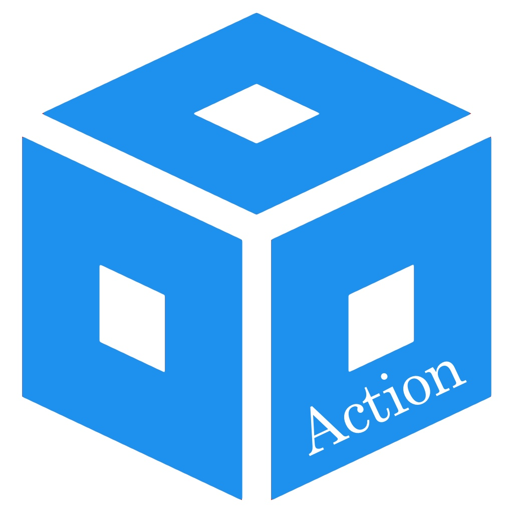

# action-ccstudio-ide


<!-- markdownlint-disable MD033 -->

<!-- markdownlint-enable MD033 -->

The [action-ccstudio-ide](https://github.com/uoohyo/action-ccstudio-ide) GitHub Action provides an automated environment for building projects within the [Code Composer Studio](https://www.ti.com/tool/CCSTUDIO) from [Texas Instruments Inc.](https://www.ti.com/) This action facilitates continuous integration and delivery (CI/CD) for embedded projects, leveraging the robust features of [Code Composer Studio](https://www.ti.com/tool/CCSTUDIO), which is an integrated development environment (IDE) designed specifically for TI's microcontrollers and processors.

## Overview

Each run of this action downloads and installs Code Composer Studio from scratch. Installation typically takes **15–30 minutes** depending on the selected components and runner performance.

> **Note:** This action runs inside a Docker container and requires a **Linux** runner (e.g. `ubuntu-22.04`).

Supported CCS versions: **v7.x – v20.x**

## Known Warnings

### SLF4J

The following lines may appear in the action log during project import or build:

```text
SLF4J: Failed to load class 'org.slf4j.impl.StaticLoggerBinder'.
SLF4J: Defaulting to no-operation (NOP) logger implementation
SLF4J: See http://www.slf4j.org/codes.html#StaticLoggerBinder for further details.
```

This is a harmless warning from Eclipse's internal logging framework. It does not affect the build result and can be safely ignored.

## Usage

To use this action in your workflow, add the following steps to your `.github/workflows` YAML file:

```yaml
name: Build Project with CCS IDE

on:
    push:
        branches: [ main ]
    pull_request:
        branches: [ main ]

jobs:
    build:
        runs-on: ubuntu-22.04
        steps:
        - uses: actions/checkout@v4
        - name: Build with Code Composer Studio IDE
          uses: uoohyo/action-ccstudio-ide@v2
          with:
              project-path: 'Project/YourProjectName'
              project-name: 'YourProjectName'
              build-config: 'Debug'
              major-ver: '20'
              minor-ver: '5'
              patch-ver: '0'
              build-ver: '00028'
              components: 'PF_C28'
```

## Inputs

### project-path (required)

The relative path from the repository root to the project directory. This path is resolved against the repository root (`/github/workspace`) inside the Docker container, so it must point to the folder containing the CCS project files (`.project`).

```yaml
with:
    project-path: 'path/to/your/project'
```

### project-name (required)

The `project-name` input specifies the name of the project within your Code Composer Studio workspace that you want to build. This name should exactly match the project name in CCS.

```yaml
with:
    project-name: 'ExampleProject'
```

### build-config (optional)

The `build-config` input determines which build configuration to use when compiling the project. Typical configurations include `Debug` or `Release`, but any custom configuration defined in your CCS project can be used.

```yaml
with:
    build-config: 'Release'  # Optional, defaults to 'Debug'
```

Default Value: If not specified, the build configuration defaults to `Debug`.

### version (optional)

The structure of the [Code Composer Studio](https://www.ti.com/tool/CCSTUDIO) version is as follows:

```text
<major-ver> . <minor-ver> . <patch-ver> . <build-ver>
```

The default version is `20.5.0.00028`. For the latest version information, visit [this link](https://www.ti.com/tool/download/CCSTUDIO).

```yaml
with:
    major-ver: '20'
    minor-ver: '5'
    patch-ver: '0'
    build-ver: '00028'
```

### components (optional)

Component selection is supported on **CCS v10 and above**. For CCS v9 and below, the installer does not support component selection — all product families are installed regardless of the `components` value.

When installing [Code Composer Studio](https://www.ti.com/tool/CCSTUDIO), you can choose from various [Texas Instruments Inc.](https://www.ti.com/) product families. Below is a list of installable product families:

| Product family    | Description                                                                  |
| ----------------- | ---------------------------------------------------------------------------- |
| PF_MSP430         | MSP430 ultra-low power MCUs                                                  |
| PF_MSP432         | SimpleLink™ MSP432™ low power + performance MCUs                             |
| PF_CC2X           | SimpleLink™ CC13xx and CC26xx Wireless MCUs                                  |
| PF_CC3X           | SimpleLink™ Wi-Fi® CC32xx Wireless MCUs                                      |
| PF_CC2538         | CC2538 IEEE 802.15.4 Wireless MCUs                                           |
| PF_C28            | C2000 real-time MCUs                                                         |
| PF_TM4C           | TM4C12x ARM® Cortex®-M4F core-based MCUs                                     |
| PF_PGA            | PGA Sensor Signal Conditioners                                               |
| PF_HERCULES       | Hercules™ Safety MCUs                                                        |
| PF_SITARA         | Sitara™ AM3x, AM4x, AM5x and AM6x MPUs (will also include AM2x for CCS 10.x) |
| PF_SITARA_MCU     | Sitara™ AM2x MCUs (only supported in CCS 11.x and greater)                   |
| PF_OMAPL          | OMAP-L1x DSP + ARM9® Processor                                               |
| PF_DAVINCI        | DaVinci (DM) Video Processors                                                |
| PF_OMAP           | OMAP Processors                                                              |
| PF_TDA_DRA        | TDAx Driver Assistance SoCs & Jacinto DRAx Infotainment SoCs                 |
| PF_C55            | C55x ultra-low-power DSP                                                     |
| PF_C6000SC        | C6000 Power-Optimized DSP                                                    |
| PF_C66AK_KEYSTONE | 66AK2x multicore DSP + ARM® Processors & C66x KeyStone™ multicore DSP        |
| PF_MMWAVE         | mmWave Sensors                                                               |
| PF_C64MC          | C64x multicore DSP                                                           |
| PF_DIGITAL_POWER  | UCD Digital Power Controllers                                                |

Multiple product families can be installed by separating their names with a comma in the `components` input:

```yaml
with:
    components: 'PF_MSP430,PF_CC2X'
```

## License

[MIT License](./LICENSE)

Copyright (c) 2024 [uoohyo](https://github.com/uoohyo)

Permission is hereby granted, free of charge, to any person obtaining a copy
of this software and associated documentation files (the "Software"), to deal
in the Software without restriction, including without limitation the rights
to use, copy, modify, merge, publish, distribute, sublicense, and/or sell
copies of the Software, and to permit persons to whom the Software is
furnished to do so, subject to the following conditions:

The above copyright notice and this permission notice shall be included in all
copies or substantial portions of the Software.

THE SOFTWARE IS PROVIDED "AS IS", WITHOUT WARRANTY OF ANY KIND, EXPRESS OR
IMPLIED, INCLUDING BUT NOT LIMITED TO THE WARRANTIES OF MERCHANTABILITY,
FITNESS FOR A PARTICULAR PURPOSE AND NONINFRINGEMENT. IN NO EVENT SHALL THE
AUTHORS OR COPYRIGHT HOLDERS BE LIABLE FOR ANY CLAIM, DAMAGES OR OTHER
LIABILITY, WHETHER IN AN ACTION OF CONTRACT, TORT OR OTHERWISE, ARISING FROM,
OUT OF OR IN CONNECTION WITH THE SOFTWARE OR THE USE OR OTHER DEALINGS IN THE
SOFTWARE.
